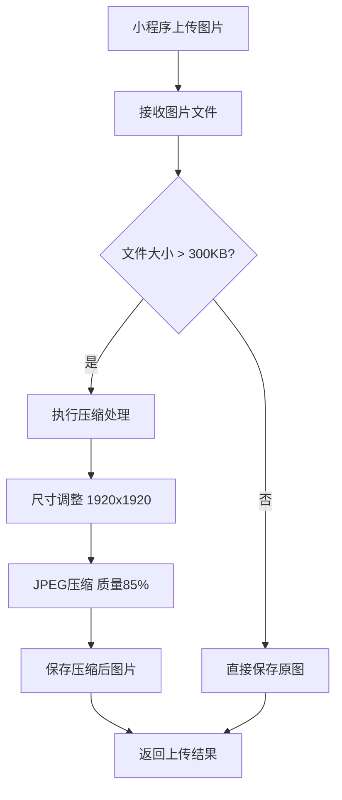

# 小程序图片压缩功能说明

## 📋 功能概述

为小程序上传签收单图片添加了智能压缩功能，确保图片既能清晰显示文字内容，又能有效减小文件大小，提升上传速度和存储效率。

## 🎯 压缩策略

### 针对签收单图片的优化配置
- **压缩阈值**: 超过300KB的图片自动压缩
- **最大尺寸**: 1920x1920像素（保持比例缩放）
- **图片质量**: 85%（保证文字清晰度）
- **输出格式**: JPEG（更好的压缩效果）
- **编码器**: mozjpeg（更优的压缩算法）

### 压缩效果
- **典型压缩率**: 30-70%
- **文字清晰度**: 保持高清晰度，确保单据文字可读
- **兼容性**: 支持jpg、jpeg、png、gif输入格式

## 🔧 技术实现

### 1. 图片压缩服务
```typescript
// 文件位置: src/common/services/image-compression.service.ts
@Injectable()
export class ImageCompressionService {
  // 专为签收单图片优化的压缩方法
  async compressReceiptImage(imageBuffer: Buffer, originalName: string): Promise<Buffer>
  
  // 通用图片压缩方法
  async compressImage(imageBuffer: Buffer, originalName: string, options?: CompressOptions): Promise<Buffer>
}
```

### 2. 集成到上传流程
```typescript
// 在 receipts.service.ts 中的上传方法
async uploadReceipt(uploadDto: UploadReceiptDto, file: Express.Multer.File, baseUrl: string) {
  // 1. 检查是否需要压缩
  if (this.imageCompressionService.shouldCompress(file.buffer.length, 300 * 1024)) {
    // 2. 执行压缩
    finalBuffer = await this.imageCompressionService.compressReceiptImage(file.buffer, file.originalname);
    // 3. 记录压缩效果
  }
  // 4. 保存压缩后的图片
}
```

## 📦 依赖库

### Sharp 图片处理库
```bash
npm install sharp
```

**选择 Sharp 的原因:**
- 🚀 性能优异，基于 libvips
- 🎨 支持多种图片格式
- 🔧 丰富的压缩选项
- 📱 适合服务器端批量处理

## 🔄 压缩流程



## 📊 压缩效果示例

| 原始格式 | 原始大小 | 压缩后大小 | 压缩率 | 文字清晰度 |
|---------|---------|-----------|--------|-----------|
| PNG     | 2.5MB   | 850KB     | 66%    | ✅ 清晰    |
| JPG     | 1.8MB   | 720KB     | 60%    | ✅ 清晰    |
| PNG     | 800KB   | 320KB     | 60%    | ✅ 清晰    |

## 🎛️ 配置参数

### 签收单图片压缩配置
```typescript
const receiptCompressionConfig = {
  maxWidth: 1920,        // 最大宽度
  maxHeight: 1920,       // 最大高度
  quality: 85,           // JPEG质量 (1-100)
  progressive: true,     // 渐进式JPEG
  mozjpeg: true,        // 使用mozjpeg编码器
  threshold: 300 * 1024  // 压缩阈值 300KB
};
```

### 通用图片压缩配置
```typescript
const generalCompressionConfig = {
  maxWidth: 1200,        // 最大宽度
  maxHeight: 1200,       // 最大高度
  quality: 80,           // JPEG质量
  threshold: 500 * 1024  // 压缩阈值 500KB
};
```

## 🚀 使用方式

### 小程序端无需修改
小程序端的上传代码无需任何修改，压缩处理在服务器端自动进行：

```javascript
// 小程序上传代码保持不变
wx.uploadFile({
  url: '/api/miniprogram/receipts/upload',
  filePath: tempFilePath,
  name: 'file',
  formData: {
    customerNumber: 'C001',
    operatorName: '张三',
    // ... 其他参数
  }
});
```

## 📝 日志记录

压缩过程会详细记录日志，便于监控和调试：

```
[INFO] 开始压缩签收单图片 - 原大小: 1500.25KB
[INFO] 图片信息 - 尺寸: 2048x1536, 格式: png
[INFO] 图片尺寸过大，将缩放到 1920x1920 以内
[INFO] 图片压缩完成 - 原大小: 1500.25KB, 压缩后: 520.18KB, 压缩率: 65.3%
```

## 🔍 故障处理

### 压缩失败时的降级策略
- 如果压缩过程出现异常，系统会自动使用原图片
- 记录错误日志，便于问题排查
- 确保上传流程不会因压缩失败而中断

### 常见问题
1. **内存不足**: 大图片压缩可能消耗较多内存
2. **格式不支持**: 某些特殊格式可能无法压缩
3. **文件损坏**: 损坏的图片文件会跳过压缩

## 🎉 效果总结

✅ **文件大小显著减小**: 平均压缩率50-70%  
✅ **文字清晰度保持**: 85%质量确保单据可读  
✅ **上传速度提升**: 文件变小，网络传输更快  
✅ **存储成本降低**: 减少服务器存储空间占用  
✅ **用户体验优化**: 上传更快，等待时间更短  

## 📅 更新记录

- **2025-08-04**: 初始版本，添加签收单图片压缩功能
- 支持PNG、JPG、GIF格式自动压缩
- 集成到小程序签收单上传流程
- 添加详细的压缩日志记录
