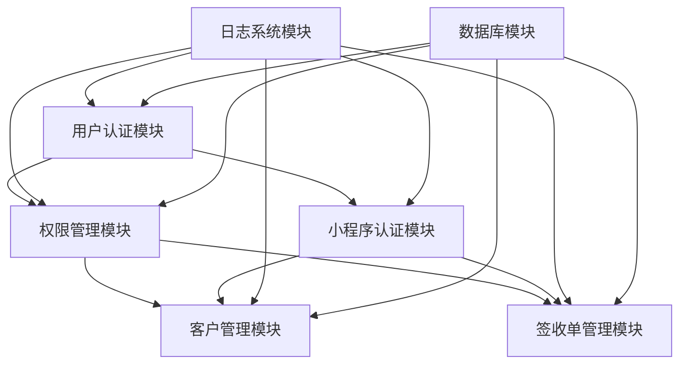

# 📚 模块实现文档目录

## 📋 概述

本目录包含物流配送管理系统各个核心模块的详细实现说明文档。每个文档都深入解析了模块的架构设计、核心代码实现、使用方式和最佳实践。

## 🗂️ 文档列表

### 🔐 认证与权限模块
- [**用户认证模块实现**](./用户认证模块实现.md) - JWT认证、密码加密、Token管理等核心认证功能
- [**权限管理模块实现**](./权限管理模块实现.md) - RBAC权限控制、角色管理、权限检查服务
- [**小程序认证模块实现**](./小程序认证模块实现.md) - 微信授权登录、设备绑定、双Token机制

### 💼 业务核心模块
- [**客户管理模块实现**](./客户管理模块实现.md) - 客户信息管理、地理编码、搜索功能
- [**签收单管理模块实现**](./签收单管理模块实现.md) - 图片上传、文件压缩、签收记录管理

### 🛠️ 系统基础模块
- [**日志系统模块实现**](./日志系统模块实现.md) - 结构化日志、追踪ID、性能监控、异常处理

## 🏗️ 模块架构概览

### 整体架构图
```
┌─────────────────────────────────────────────────────────────┐
│                    物流配送管理系统                          │
├─────────────────────────────────────────────────────────────┤
│  🔐 认证与权限层                                            │
│  ├── 用户认证模块 (JWT + bcrypt)                           │
│  ├── 权限管理模块 (RBAC + CASL)                            │
│  └── 小程序认证模块 (微信授权 + 设备绑定)                   │
├─────────────────────────────────────────────────────────────┤
│  💼 业务逻辑层                                              │
│  ├── 客户管理模块 (CRUD + 地理编码)                        │
│  ├── 签收单管理模块 (文件上传 + 图片处理)                   │
│  └── 小程序接口模块 (移动端API)                            │
├─────────────────────────────────────────────────────────────┤
│  🛠️ 系统基础层                                              │
│  ├── 日志系统模块 (Winston + 追踪ID)                       │
│  ├── 数据库模块 (TypeORM + MySQL)                          │
│  └── 文件存储模块 (本地存储 + 压缩)                         │
├─────────────────────────────────────────────────────────────┤
│  🌐 网络通信层                                              │
│  ├── HTTP中间件 (CORS + 请求日志)                          │
│  ├── 异常处理 (全局过滤器)                                  │
│  └── API文档 (Swagger)                                     │
└─────────────────────────────────────────────────────────────┘
```

## 🔄 模块间依赖关系

### 依赖关系图


## 📖 阅读指南

### 🎯 按角色阅读
- **后端开发者**: 重点阅读认证、权限、业务模块的服务层实现
- **前端开发者**: 重点阅读各模块的API接口和前端集成示例
- **系统管理员**: 重点阅读日志系统、权限配置和部署相关内容
- **架构师**: 重点阅读模块架构设计和依赖关系

### 🔍 按功能阅读
- **安全相关**: 用户认证 → 权限管理 → 小程序认证
- **业务功能**: 客户管理 → 签收单管理
- **系统运维**: 日志系统 → 监控告警

### 📚 学习路径
1. **基础理解**: 先阅读系统架构概览，了解整体设计
2. **核心功能**: 从用户认证模块开始，理解安全机制
3. **业务逻辑**: 学习客户管理和签收单管理的业务实现
4. **系统运维**: 掌握日志系统和监控机制

## 🛠️ 技术栈总览

### 后端技术栈
```typescript
// 核心框架
NestJS 10.x + TypeScript 5.x

// 数据库
MySQL 8.0 + TypeORM 0.3.x

// 认证授权
JWT + bcrypt + CASL + Passport

// 日志系统
Winston + DailyRotateFile

// 文件处理
Multer + Sharp + fs-extra

// API文档
Swagger/OpenAPI 3.0
```

### 前端技术栈
```typescript
// 管理后台
Next.js 15.3.4 + React 18 + TypeScript

// UI组件库
Arco Design + TailwindCSS 3.x

// 状态管理
React Hooks + Context API

// HTTP客户端
Axios + React Query

// 表单处理
React Hook Form + Yup
```

## 📋 代码规范

### 命名规范
- **文件命名**: kebab-case (例: `user-auth.service.ts`)
- **类命名**: PascalCase (例: `UserAuthService`)
- **方法命名**: camelCase (例: `getUserInfo`)
- **常量命名**: UPPER_SNAKE_CASE (例: `MAX_FILE_SIZE`)

### 目录结构规范
```
src/
├── module-name/
│   ├── module-name.controller.ts    # 控制器
│   ├── module-name.service.ts       # 服务
│   ├── module-name.module.ts        # 模块定义
│   ├── entities/                    # 实体定义
│   ├── dto/                         # 数据传输对象
│   ├── interfaces/                  # 接口定义
│   └── services/                    # 子服务
```

### 注释规范
```typescript
/**
 * 用户认证服务
 * 负责处理用户登录、注册、密码重置等功能
 */
@Injectable()
export class AuthService {
  /**
   * 用户登录
   * @param loginDto 登录信息
   * @param req 请求对象
   * @returns 登录结果包含用户信息和Token
   */
  async login(loginDto: LoginDto, req?: any): Promise<LoginResponseDto> {
    // 实现逻辑...
  }
}
```

## 🔧 开发工具

### 推荐IDE配置
- **VSCode**: 推荐安装 TypeScript、Prettier、ESLint 插件
- **WebStorm**: 内置TypeScript支持，配置代码格式化规则

### 调试工具
- **后端调试**: VSCode Debug配置 + Chrome DevTools
- **API测试**: Swagger UI + Postman
- **数据库**: MySQL Workbench + phpMyAdmin

## 📊 性能监控

### 关键指标
- **响应时间**: API接口平均响应时间 < 200ms
- **并发处理**: 支持100+并发用户
- **内存使用**: 服务器内存使用率 < 80%
- **数据库**: 查询响应时间 < 100ms

### 监控工具
- **日志监控**: Winston + 自定义日志分析
- **性能监控**: 内置性能日志记录
- **错误监控**: 全局异常过滤器 + 错误日志

## 🚀 部署指南

### 环境要求
- **Node.js**: >= 18.18.0
- **MySQL**: >= 8.0
- **内存**: >= 2GB
- **存储**: >= 10GB

### 快速部署
```bash
# 1. 克隆项目
git clone <repository-url>

# 2. 安装依赖
npm install

# 3. 配置环境变量
cp .env.example .env

# 4. 初始化数据库
mysql -u root -p < init.sql

# 5. 启动服务
./ser.sh start all
```

## 📞 技术支持

### 文档维护
- **更新频率**: 随代码更新同步维护
- **版本控制**: 使用Git管理文档版本
- **反馈渠道**: 通过Issue或邮件反馈问题

### 联系方式
- **技术讨论**: 项目Issue区
- **紧急支持**: 系统管理员邮箱
- **文档建议**: 开发团队邮箱

---

**💡 提示**: 建议按照上述阅读指南选择适合的文档进行深入学习。每个模块文档都包含完整的代码示例和最佳实践，可以直接用于项目开发参考。
