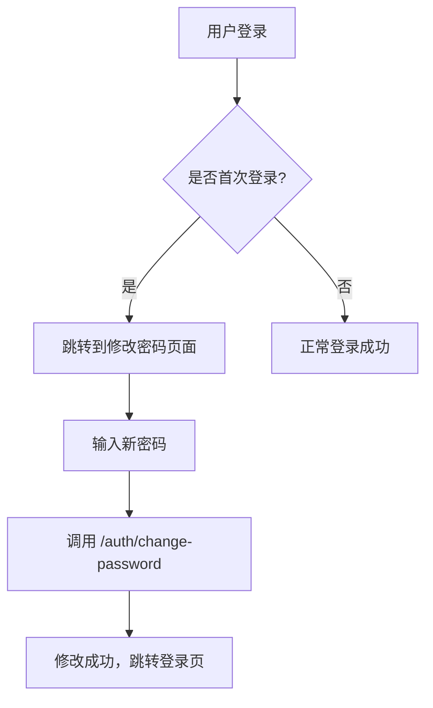
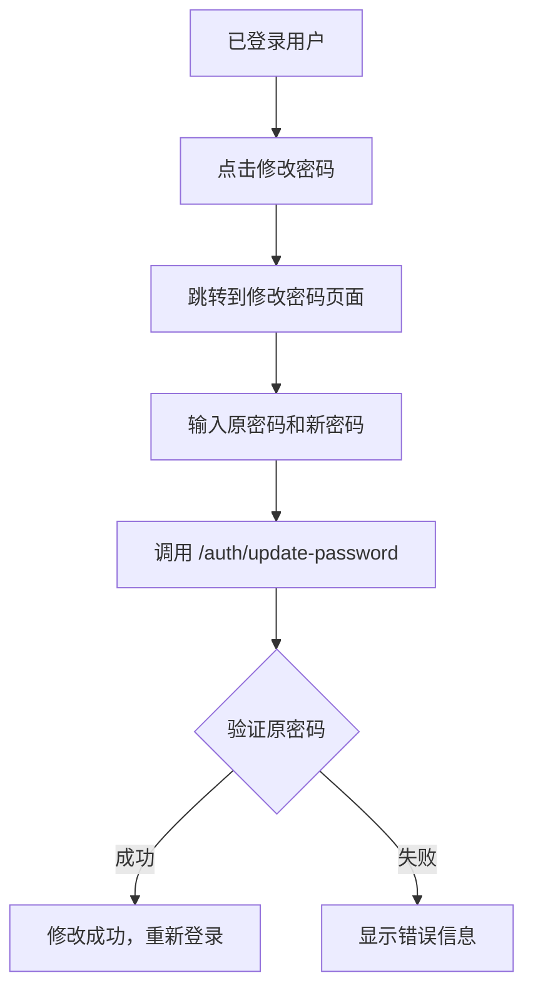

# 密码修改接口设计文档

## 📋 概述

为了提高系统安全性，我们将密码修改功能拆分为两个独立的接口，分别处理不同的使用场景：

1. **首次登录修改密码** - `/auth/change-password`
2. **用户主动修改密码** - `/auth/update-password`

## 🔗 接口详情

### 1. 首次登录修改密码接口

**接口路径：** `POST /api/auth/change-password`

**使用场景：**
- 新用户首次登录
- 管理员重置密码后的首次登录
- 系统强制要求修改密码的场景

**安全特性：**
- ❌ **不需要**验证原密码（因为是强制修改）
- ✅ 支持加密传输
- ✅ 密码格式验证
- ✅ 防止与用户名相同

**请求参数：**
```typescript
{
  userId: number;           // 用户ID
  newPassword: string;      // 新密码（可能是加密的）
  timestamp?: number;       // 时间戳（加密传输时使用）
  signature?: string;       // 数字签名（加密传输时使用）
  _encrypted?: boolean;     // 是否为加密数据
}
```

**前端页面：** `/change-password`

---

### 2. 用户主动修改密码接口

**接口路径：** `POST /api/auth/update-password`

**使用场景：**
- 用户在个人设置中修改密码
- 定期更换密码的安全需求
- 怀疑密码泄露时的主动更换

**安全特性：**
- ✅ **必须**验证原密码
- ✅ 需要JWT token认证
- ✅ 支持加密传输
- ✅ 密码格式验证
- ✅ 防止新旧密码相同

**请求参数：**
```typescript
{
  oldPassword: string;      // 原密码（可能是加密的）
  newPassword: string;      // 新密码（可能是加密的）
  timestamp?: number;       // 时间戳（加密传输时使用）
  signature?: string;       // 数字签名（加密传输时使用）
  _encrypted?: boolean;     // 是否为加密数据
}
```

**前端页面：** `/update-password`

## 🛡️ 安全对比

| 特性 | 首次登录修改 | 用户主动修改 |
|------|-------------|-------------|
| 验证原密码 | ❌ 不需要 | ✅ 必须验证 |
| JWT认证 | ❌ 不需要 | ✅ 必须认证 |
| 加密传输 | ✅ 支持 | ✅ 支持 |
| 密码格式验证 | ✅ 支持 | ✅ 支持 |
| 防重复密码 | ✅ 与用户名 | ✅ 与原密码 |

## 🎯 使用流程

### 首次登录修改密码流程


### 用户主动修改密码流程


## 📁 文件结构

### 后端文件
```
backend-node/src/auth/
├── auth.controller.ts     # 两个密码修改接口
├── auth.service.ts        # 密码修改业务逻辑
└── utils/crypto.util.ts   # 密码加密解密工具
```

### 前端文件
```
admin-frontend/src/app/
├── change-password/       # 首次登录修改密码页面
│   └── page.tsx
├── update-password/       # 用户主动修改密码页面
│   └── page.tsx
└── page.tsx              # 主页（添加了修改密码入口）
```

## 🔧 技术实现

### 密码验证逻辑
```typescript
// 首次登录修改密码（AuthService.changePassword）
async changePassword(userId: number, newPassword: string): Promise<void> {
  // 不验证原密码，直接更新
  await this.usersService.changePassword(userId, newPassword);
}

// 用户主动修改密码（AuthService.updatePassword）
async updatePassword(userId: number, oldPassword: string, newPassword: string): Promise<void> {
  // 1. 验证原密码
  const isOldPasswordValid = await bcrypt.compare(oldPassword, user.password);
  
  // 2. 验证新密码不能与原密码相同
  const isSamePassword = await bcrypt.compare(newPassword, user.password);
  
  // 3. 更新密码
  await this.usersService.changePassword(userId, newPassword);
}
```

### 前端加密传输
```typescript
// 两个接口都支持相同的加密方式
const secureData = createSecureLoginData('', password);
const requestData = {
  password: secureData.password,    // 加密后的密码
  timestamp: secureData.timestamp,
  signature: secureData.signature,
  _encrypted: true
};
```

## 📝 API响应格式

### 成功响应
```json
{
  "code": 200,
  "message": "密码修改成功",
  "data": null
}
```

### 错误响应
```json
{
  "code": 401,
  "message": "原密码错误",
  "data": null
}
```

## 🚀 部署说明

1. **后端部署**：无需额外配置，接口已集成到现有认证模块
2. **前端部署**：新增页面会自动包含在构建中
3. **数据库**：无需修改数据库结构
4. **兼容性**：向后兼容，不影响现有功能

## ✅ 测试建议

### 首次登录修改密码测试
1. 创建新用户
2. 使用默认密码登录
3. 验证是否跳转到修改密码页面
4. 测试密码格式验证
5. 测试修改成功后的登录

### 用户主动修改密码测试
1. 正常登录用户
2. 访问修改密码页面
3. 测试原密码验证
4. 测试新密码格式验证
5. 测试修改成功后需要重新登录

## 🔄 后续优化建议

1. **密码强度检测**：可以添加更复杂的密码强度要求
2. **密码历史记录**：防止使用最近使用过的密码
3. **修改频率限制**：防止频繁修改密码
4. **邮件通知**：密码修改后发送邮件通知
5. **审计日志**：记录密码修改操作的详细日志
