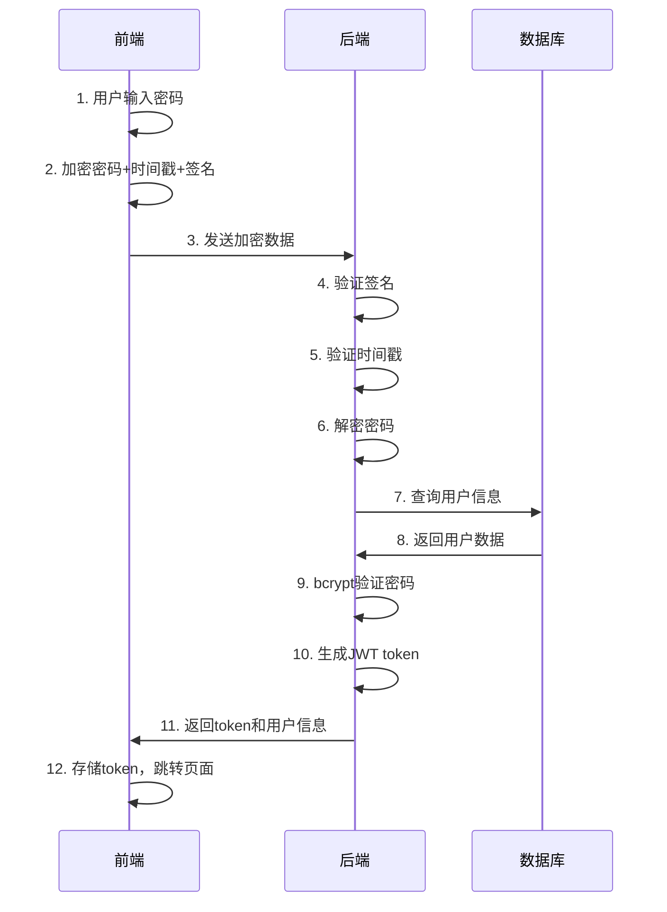

# 登录接口安全机制详解

## 📋 概述

本文档详细说明了物流配送管理系统的登录接口实现，包括密码加密传输、防重放攻击、数据完整性验证等安全机制。

## 🔐 安全架构

### 核心安全特性
- ✅ **密码加密传输**：前端加密，后端解密
- ✅ **防重放攻击**：时间戳验证机制
- ✅ **数据完整性**：数字签名验证
- ✅ **向后兼容**：支持明文和加密两种模式
- ✅ **JWT认证**：安全的令牌管理

## 📡 接口详情

### 登录接口
- **接口地址**：`POST /api/auth/login`
- **强制登录**：`POST /api/auth/login/force`
- **用户信息**：`GET /api/auth/profile`
- **登出接口**：`POST /api/auth/logout`

## 🔄 完整登录流程

### 1. 前端加密流程

```typescript
// 1. 用户输入密码
const loginForm = {
  username: 'admin',
  password: '123456'  // 明文密码
};

// 2. 创建安全数据包
const secureData = createSecureLoginData(username, password);
```

#### 加密算法详解
```typescript
export function encryptPassword(password: string): string {
  // Step 1: 创建数据包
  const data = {
    password: '123456',           // 原始密码
    timestamp: 1704387123456,     // 当前时间戳
    nonce: 'abc123'              // 随机数
  };
  
  // Step 2: JSON序列化
  const jsonData = JSON.stringify(data);
  
  // Step 3: Base64编码
  const base64Data = btoa(jsonData);
  
  // Step 4: XOR加密
  const encrypted = base64Data
    .split('')
    .map((char, index) => {
      const keyChar = ENCRYPTION_KEY.charCodeAt(index % ENCRYPTION_KEY.length);
      return String.fromCharCode(char.charCodeAt(0) ^ keyChar);
    })
    .join('');
  
  // Step 5: 再次Base64编码
  return btoa(encrypted);
}
```

#### 数字签名生成
```typescript
export function generateSignature(data: string): string {
  let hash = 0;
  for (let i = 0; i < data.length; i++) {
    const char = data.charCodeAt(i);
    hash = ((hash << 5) - hash) + char;
    hash = hash & hash; // Convert to 32-bit integer
  }
  return Math.abs(hash).toString(36);
}

// 签名计算
const signature = generateSignature(`${username}${encryptedPassword}${timestamp}`);
```

### 2. 传输数据格式

#### 加密传输格式
```json
{
  "username": "admin",
  "password": "U2FsdGVkX1/8K7gWn5W2...", 
  "timestamp": 1704387123456,
  "signature": "a7b8c9d",
  "_encrypted": true
}
```

#### 兼容明文格式
```json
{
  "username": "admin",
  "password": "123456"
}
```

### 3. 后端解密流程

```typescript
async login(loginDto: LoginDto, req?: any): Promise<LoginResponseDto> {
  let actualPassword: string;
  
  // 检查是否为加密数据
  if (loginDto._encrypted && loginDto.timestamp && loginDto.signature) {
    console.log('检测到加密登录数据，开始解密处理');
    
    // Step 1: 验证数字签名
    if (!validateSignature(loginDto.username, loginDto.password, 
                          loginDto.timestamp, loginDto.signature)) {
      throw new UnauthorizedException('数据签名验证失败');
    }
    
    // Step 2: 验证时间戳（防重放攻击）
    if (!validateTimestamp(loginDto.timestamp)) {
      throw new UnauthorizedException('请求已过期，请重新登录');
    }
    
    // Step 3: 解密密码
    const decryptedData = decryptPassword(loginDto.password);
    actualPassword = decryptedData.password;
    
  } else {
    // 兼容明文密码
    actualPassword = loginDto.password;
  }
  
  // Step 4: 正常登录验证流程
  const user = await this.validateUser(loginDto.username, actualPassword);
  // ...
}
```

#### 解密算法详解
```typescript
export function decryptPassword(encryptedData: string): {
  password: string;
  timestamp: number;
  nonce: string;
} {
  // Step 1: 第一次Base64解码
  const firstDecoded = Buffer.from(encryptedData, 'base64').toString();
  
  // Step 2: XOR解密（逆向加密过程）
  const decrypted = firstDecoded
    .split('')
    .map((char, index) => {
      const keyChar = ENCRYPTION_KEY.charCodeAt(index % ENCRYPTION_KEY.length);
      return String.fromCharCode(char.charCodeAt(0) ^ keyChar);
    })
    .join('');
  
  // Step 3: 第二次Base64解码
  const jsonData = Buffer.from(decrypted, 'base64').toString();
  
  // Step 4: JSON解析
  return JSON.parse(jsonData);
}
```

### 4. 安全验证机制

#### 时间戳验证（防重放攻击）
```typescript
export function validateTimestamp(timestamp: number, maxAgeMs: number = 5 * 60 * 1000): boolean {
  const now = Date.now();
  const age = now - timestamp;
  
  // 检查时间戳是否在5分钟内
  return age >= 0 && age <= maxAgeMs;
}
```

#### 数字签名验证
```typescript
export function validateSignature(
  username: string,
  encryptedPassword: string, 
  timestamp: number,
  signature: string
): boolean {
  const expectedSignature = generateSignature(`${username}${encryptedPassword}${timestamp}`);
  return expectedSignature === signature;
}
```

### 5. JWT Token生成

```typescript
// 生成JWT载荷
const payload = {
  sub: user.id,
  username: user.username,
  nickname: user.nickname,
  roles: user.roles || [],
  userType: 'admin',
  exp: Math.floor(Date.now() / 1000) + (60 * 60), // 1小时过期
  iat: Math.floor(Date.now() / 1000)
};

const accessToken = this.jwtService.sign(payload);
```

## 🔒 安全特性详解

### 1. 多层加密保护

| 层级 | 算法 | 作用 |
|------|------|------|
| 1 | JSON序列化 | 数据结构化 |
| 2 | Base64编码 | 二进制安全 |
| 3 | XOR加密 | 内容混淆 |
| 4 | 再次Base64 | 传输安全 |

### 2. 防重放攻击机制

```typescript
// 前端：添加时间戳
const timestamp = Date.now();

// 后端：验证时间窗口
const maxAge = 5 * 60 * 1000; // 5分钟
if (now - timestamp > maxAge) {
  throw new Error('请求已过期');
}
```

### 3. 数据完整性保护

```typescript
// 签名数据包含：用户名 + 加密密码 + 时间戳
const dataToSign = `${username}${encryptedPassword}${timestamp}`;
const signature = generateSignature(dataToSign);
```

## 🚨 错误处理机制

### 客户端错误
- **密码加密失败**：提示用户重试
- **网络错误**：显示网络连接失败
- **服务器错误**：显示具体错误信息

### 服务端错误
- **签名验证失败**：`数据签名验证失败`
- **时间戳过期**：`请求已过期，请重新登录`
- **解密失败**：`密码解密失败`
- **用户验证失败**：`用户名或密码错误`

## 📊 数据流转图



## 🔧 配置说明

### 前端配置
```typescript
// crypto.ts
const ENCRYPTION_KEY = 'logistics-frontend-2024-secure-key-v1';
```

### 后端配置  
```typescript
// crypto.util.ts
const ENCRYPTION_KEY = 'logistics-frontend-2024-secure-key-v1'; // 必须与前端一致

// JWT配置
const JWT_SECRET = process.env.JWT_SECRET || 'logistics-system-jwt-secret-2024';
```

### 环境变量
```bash
# .env
JWT_SECRET=your-super-secret-jwt-key-2024
DB_HOST=localhost
DB_PORT=3306
DB_USERNAME=root
DB_PASSWORD=123456
DB_DATABASE=logistics_db
```

## 🎯 生产环境建议

### 1. HTTPS部署
```nginx
server {
    listen 443 ssl;
    server_name your-domain.com;
    
    ssl_certificate /path/to/certificate.crt;
    ssl_certificate_key /path/to/private.key;
    
    location /api/ {
        proxy_pass http://localhost:3000;
        proxy_set_header X-Real-IP $remote_addr;
        proxy_set_header X-Forwarded-For $proxy_add_x_forwarded_for;
    }
}
```

### 2. 安全增强配置
```typescript
// 生产环境配置
const PRODUCTION_CONFIG = {
  // 更短的时间窗口
  maxTimestampAge: 2 * 60 * 1000, // 2分钟
  
  // 更强的加密
  encryptionAlgorithm: 'AES-256-GCM',
  
  // 动态密钥
  keyRotationInterval: 24 * 60 * 60 * 1000, // 24小时
  
  // JWT短期化
  jwtExpiration: '15m',
  refreshTokenExpiration: '7d'
};
```

### 3. 监控和日志
```typescript
// 安全事件监控
const securityLogger = {
  loginAttempt: (username, ip, success) => {
    console.log(`Login attempt: ${username} from ${ip} - ${success ? 'SUCCESS' : 'FAILED'}`);
  },
  
  encryptionError: (error, ip) => {
    console.error(`Encryption error from ${ip}:`, error);
  },
  
  timestampError: (timestamp, ip) => {
    console.warn(`Timestamp validation failed from ${ip}: ${timestamp}`);
  }
};
```

## 🔍 调试和测试

### 前端调试
```javascript
// 在浏览器控制台查看加密过程
console.log('=== 密码加密传输 ===');
console.log('原始密码长度:', password.length);
console.log('加密后数据:', secureData);
```

### 后端调试
```typescript
// 在服务器日志查看解密过程
console.log('检测到加密登录数据，开始解密处理');
console.log('密码解密成功');
console.log('✅ 登录成功 - 密码加密传输有效');
```

### API测试
```bash
# 测试加密登录
curl -X POST http://localhost:3000/api/auth/login \
  -H "Content-Type: application/json" \
  -d '{
    "username": "admin",
    "password": "SGVhZGVyIERhdGE6...",
    "timestamp": 1704387123456,
    "signature": "a7b8c9d",
    "_encrypted": true
  }'

# 测试兼容性登录
curl -X POST http://localhost:3000/api/auth/login \
  -H "Content-Type: application/json" \
  -d '{
    "username": "admin", 
    "password": "123456"
  }'
```

## 📈 性能考虑

### 加密性能
- **前端加密**：~1-2ms（客户端CPU）
- **后端解密**：~1-3ms（服务器CPU）  
- **总体影响**：可忽略不计

### 网络传输
- **明文大小**：~50 bytes
- **加密大小**：~200-300 bytes
- **增加量**：4-6倍（可接受）

## 🔄 升级路径

### Phase 1 - 当前实现
- ✅ Base64 + XOR加密
- ✅ 时间戳防重放
- ✅ 数字签名验证

### Phase 2 - 增强版本  
- 🔄 RSA/AES强加密
- 🔄 动态密钥交换
- 🔄 证书绑定验证

### Phase 3 - 企业级
- 🔄 硬件安全模块
- 🔄 多因子认证
- 🔄 生物识别集成

## 📝 更新日志

### v1.0.0 (2024-01-20)
- ✨ 实现密码加密传输
- ✨ 添加防重放攻击机制  
- ✨ 集成数字签名验证
- ✨ 保持向后兼容性
- 📚 完善文档和测试

---

**注意**：本文档包含敏感的安全实现细节，请妥善保管，不要泄露给未授权人员。 